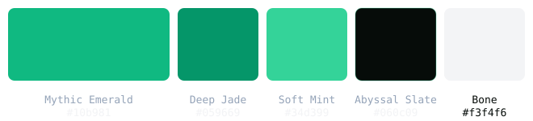

# HYDRA SAMO

## Brand Identity System — Engineering Documentation — Production Handbook


**Version:** 1.0
**Release Status:** PRODUCTION-READY
**Publication Date:** 2026-08-05
**Repository Version:** v4.0.0 — "One Body, Three Heads"
**Brand Owner:** Bendali Issam Eddine (Hydra Samo)

*The definitive reference manual for the HYDRA SAMO Brand Identity System. Supersedes the individual engineering documents for reading purposes; the original documents remain the official source files.*

---

# Table of Contents

- [1. Introduction](#1-introduction)
- [2. Brand Philosophy](#2-brand-philosophy)
- [3. Creative Vision](#3-creative-vision)
- [4. Design Principles](#4-design-principles)
- [5. Logo Evolution](#5-logo-evolution)
- [6. Geometry](#6-geometry)
- [7. Construction](#7-construction)
- [8. Hexagonal Grid System](#8-hexagonal-grid-system)
- [9. Optical Corrections](#9-optical-corrections)
- [10. Symbol Meaning](#10-symbol-meaning)
- [11. Typography](#11-typography)
- [12. Color System](#12-color-system)
- [13. Iconography](#13-iconography)
- [14. Motion System](#14-motion-system)
- [15. Website Integration](#15-website-integration)
- [16. Development Architecture](#16-development-architecture)
- [17. SVG Engineering](#17-svg-engineering)
- [18. Component Implementation](#18-component-implementation)
- [19. Asset Pipeline](#19-asset-pipeline)
- [20. Production Workflow](#20-production-workflow)
- [21. QA Process](#21-qa-process)
- [22. Certification](#22-certification)
- [23. Brand Freeze](#23-brand-freeze)
- [24. Governance](#24-governance)
- [25. Repository Structure](#25-repository-structure)
- [26. Asset Library](#26-asset-library)
- [27. Print System](#27-print-system)
- [28. Social System](#28-social-system)
- [29. Motion Deliverables](#29-motion-deliverables)
- [30. Website Assets](#30-website-assets)
- [31. Developer Guide](#31-developer-guide)
- [32. File Structure](#32-file-structure)
- [33. Version History](#33-version-history)
- [34. Future Versioning](#34-future-versioning)
- [35. Final Release](#35-final-release)
- [36. Appendix](#36-appendix)

---

# 1. Introduction

## 1.1 The Brand

HYDRA SAMO is a premium portfolio and creative studio specializing in **Video Editing**, **Motion Design**, and **Voice Over** — three disciplines, one unified body of work. The brand is the creative output of **Bendali Issam Eddine** (Hydra Samo), a solo creative studio operating as the sole approval authority for every branding decision.

| Field | Value |
|---|---|
| Brand owner | Bendali Issam Eddine (Hydra Samo) — solo creative studio |
| Repository | `hydra-samo/HYDRA-SAMO-LABS` |
| Live URL | `https://hydra-samo.github.io/HYDRA-SAMO-LABS/` |
| Copyright | Bendali Issam Eddine (Hydra Samo) |
| License | Proprietary — all rights reserved |
| System steward | Lead Brand Systems Engineer (production pipeline) |

## 1.2 Purpose of This Book

This publication compiles the **entire HYDRA SAMO Brand Identity System** — from design brief through certification, production, packaging, and release — into a single coherent reference. It consolidates the complete project history so that:

- No design decision is lost.
- No engineering rationale is lost.
- No governance rule is lost.
- The brand can be reproduced from a single authoritative document.

## 1.3 How to Read This Book

The book is organized into 36 chapters mirroring the brand lifecycle:

1. **Foundation (1–4):** what the brand is and why it exists.
2. **Design System (5–14):** logo evolution, geometry, construction, color, typography, iconography, motion.
3. **Engineering & Integration (15–18):** website architecture, SVG engineering, component implementation.
4. **Production (19–32):** asset pipeline, QA, certification, governance, and every deliverable system.
5. **Release & Future (33–36):** versioning, final release, and the appendix.

Every chapter references the authoritative source documents in the repository; where information appeared in multiple documents it has been **merged, not duplicated**.

## 1.4 Lifecycle Summary

| Phase | Source docs | Status |
|---|---|---|
| Design specification | `DESIGN.md`, `AGENTS.md` | ✅ Complete |
| Independent reviews | `OUTPUT/01` … `04` | ✅ Complete |
| Consensus review | `OUTPUT/05` | ✅ Complete |
| Implementation plan | `OUTPUT/06` | ✅ Complete |
| Changelog | `OUTPUT/07` | ✅ Complete |
| Final certification | `OUTPUT/08` | ✅ CERTIFIED |
| Brand freeze | `OUTPUT/09` | ✅ LOCKED |
| Master asset | `OUTPUT/10` | ✅ Complete |
| Export pipeline | `OUTPUT/11` | ✅ Complete |
| Website assets | `OUTPUT/12` | ✅ Complete |
| Motion system | `OUTPUT/13` | ✅ Complete |
| Social system | `OUTPUT/14` | ✅ Complete |
| Print system | `OUTPUT/15` | ✅ Complete |
| Brand governance | `OUTPUT/16` | ✅ Complete |
| File structure | `OUTPUT/17` | ✅ Complete |
| QA validation | `OUTPUT/18` | ✅ Complete |
| Final release | `OUTPUT/19` | ✅ Complete |
| Asset production | `OUTPUT/20` + report | ✅ Complete |
| Production QA | `OUTPUT/21` + report | ✅ PASSED |
| Completion audit | `OUTPUT/22` + report | ✅ Complete |
| Release packaging | `OUTPUT/23` + report | ✅ Complete |
| Final sign-off | `OUTPUT/24` + report | ✅ COMPLETE |
| Pipeline execution | `OUTPUT/25` + execution | ✅ Complete |
| Complete brand system | `OUTPUT/26` | ✅ Complete |
| Brand book | `OUTPUT/27` | ✅ This document |

---

# 2. Brand Philosophy

## 2.1 One Body, Three Heads

The HYDRA SAMO identity is built on a single organizing idea: **one body, three heads**. The three disciplines — Video Editing, Motion Design, and Voice Over — are not three separate businesses under one name; they are three specialized capabilities growing from one unified creative body. The identity must therefore read as a *single organism*, never as a collection of disconnected marks.

## 2.2 The Hidden Hydra Principle

The mark must not immediately appear to be a hydra. At first glance it reads as a clean, engineered, tri-symmetric geometric emblem. Only after a closer look does the viewer realize the symbol subtly forms a three-headed serpent. The discovery must feel **intentional and satisfying** — the icon rewards attention without relying on obvious creature details.

## 2.3 Aesthetic: Bio-Organic Dark Editorial

The visual language is immersive, high-contrast, dark-mode-first editorial showcase:

- Deep Abyssal canvas.
- Mythic Emerald life-signal accents.
- Glassmorphic surfaces over a film-grain atmosphere.
- Engineered precision that still feels organic — a "hydra discovered inside a futuristic interface."

## 2.4 Banned Anti-Patterns

The following are **strictly forbidden** in every language, locale, and surface:

| Anti-pattern | Examples |
|---|---|
| Neon cyan | `#00FFCC`, `#00F0FF`, `#00E5FF`, default neon Tailwind colors |
| Bright blue gradients | Cyan/blue gradient accents |
| SaaS eyebrow pills | `// SECTION_TITLE` mono eyebrows, pill wrappers |
| Comparison matrices | Rigid corporate "Agency vs Hydra" tables |
| Numbered badges | `01`, `02` rigid numbered markers |
| Geo/location badges | `ALGERIA // GLOBAL`, "Based in …", country pins — in any locale |

These were codified during the review pipeline and remain active governance (`DESIGN.md`, `AGENTS.md`).

## 2.5 Communication Values

The brand communicates: **Precision, Movement, Creativity, Innovation, Craftsmanship, Intelligence, Trust, and Premium quality** — with the quiet confidence of a lasting identity rather than a transient trend.

---

# 3. Creative Vision

## 3.1 The Design Brief

The master logo design brief defines a single iconic SVG brand mark for HYDRA SAMO. The mark must consist of **only one icon** — no text, no initials, no typography, no slogan, no border, no background, no decorative elements.

It should feel timeless, premium, confident, and instantly recognizable — in the company of brands such as Apple, Nike, Vercel, Linear, Framer, Mercedes-Benz, Nothing, and OpenAI. Not trendy. Not flashy. Not illustrative. Not generic AI art. It must still feel modern twenty years from now.

## 3.2 Vision Statements

- **A hidden symbol discovered inside a futuristic interface** — an abstract geometric emblem that quietly reveals a three-headed hydra.
- **Simple enough to be recognized instantly**; distinctive enough to stand on its own without text; refined enough to become the lasting visual identity.
- **Engineered, not illustrated** — every angle, intersection, and curve appears mathematically intentional.

## 3.3 The Concept Is Approved

The concept — three heads, one body, one engine — was **unanimously defended** across all independent reviews. The reviews refined the *perceptibility* of the concept, never the concept itself.

---

# 4. Design Principles

## 4.1 Core Principles

1. **Identity before decoration.** The "three heads, one body" read is sacred; any treatment that obscures it fails.
2. **Monochrome-first.** The design must be perfect in solid black before color; recoloring must be effortless.
3. **Single source of truth.** One certified master; every raster, icon, social asset, print file, and motion asset is derived from it. Re-export only, never re-create.
4. **Lighting lives outside the SVG.** All glow, shadow, and reflection are external CSS utilities — never baked into the vector.
5. **Restraint over ornament.** Minimal anchor points, clean cubic Béziers, generous negative space, no gradients, no effects, no embedded rasters in the master vector.
6. **Motion is opt-in and settled.** Approved effects reveal the mark and settle; the only approved loop is the low-key loading pulse.
7. **Accessibility is non-negotiable.** `prefers-reduced-motion`, decorative `aria-hidden`, WCAG AA contrast.
8. **Vector discipline.** True SVG, pixel-perfect geometry, crisp at 16×16, fully editable in Figma, Illustrator, and Inkscape.

## 4.2 What the Mark Must Do

The logo must:

- Work as favicon (16 px), app icon, loading animation, watermark, and social avatar.
- Be monochrome-true (`currentColor`).
- Be motion-ready (stroke drawing, glow, pulse, hover) without losing identity.
- Remain legible from 16 px to billboard scale.

## 4.3 What the Mark Must Never Do

From the negative prompt: no fantasy hydras, realistic snakes, dragons, esports/gaming logos, mascots, clipart, NFT/crypto styling, shields, crests, crowns, wings, eyes, teeth, tongues, scales, tribal patterns, medieval styling, lettermarks, monograms, typography inside the mark, stock-logo aesthetics — or anything that feels aggressive, generic, or obviously AI-generated.

---

# 5. Logo Evolution

## 5.1 Timeline

| Version | Description | Status |
|---|---|---|
| **V1** | Original concept | Superseded |
| **V2** | Pre-refinement baseline — 3-fold master head path + pointy-top hexagon core (circumradius 14.5) | Superseded |
| **V4** | Certified refinement of V2 — locked serpent-head geometry + R17 hex core, shared optical frame | ✅ CERTIFIED — permanent |

## 5.2 Review Cycle 2026-08-05 (First Review)

The first independent review cycle scored the V2 baseline:

| Category | Reviewer | Score |
|---|---|---|
| Creative Direction | Creative Director | 63 / 100 |
| Construction | Senior Logo Designer | 67 / 100 |
| Brand Recognition | Brand Recognition Specialist | 53 / 100 |
| Risk / Gatekeeping | Devil's Advocate | 54 / 100 |
| **Consensus Overall** | **All reviewers** | **59 / 100** |

**Verdict: REFINE.**

### Major Findings

1. **Favicon fails at 16 px** (Critical) — three heads + hexagon merge into a blob; mark small and off-center in the tile.
2. **Optical frame off** (High) — mark occupies y 11.5–69.9 of the 0–100 canvas; ~30% dead space below.
3. **Wrong perceptual category** (High) — reads rotor / drone / fan / generic tech crest, not a creative hydra.
4. **Construction kinks** (Medium) — non-tangent joints at the throat notch and lower-right base.
5. **Off-brand social asset** (High) — OpenGraph image steel-blue and under-sized vs the live emerald mark.
6. **Unused legacy colorways** (Medium) — teal / violet / warm rasters remained in the repo.
7. **Hidden hydra invisible** (Medium) — concept correct, perceptibility insufficient.

### Strengths Recorded

- Concept: three heads, one body, one engine — unanimously defended.
- Exact regular hexagon core (circumradius 14.5); correct 3-fold rotation construction.
- Exemplary SVG discipline: `currentColor`, `pathLength`, no baked decoration, clean markup.
- Consistent website integration across nav / hero / pre-splash / splash.

## 5.3 Refinement Plan (Priority 1)

The implementation plan (`OUTPUT/06`) defined launch-blocking changes:

- **P1-1** Fix the optical frame (viewBox re-balance → ≥75% coverage, optical center at center).
- **P1-2** Provide a dedicated favicon that reads at 16 px.
- **P1-3** Make the head read as a head, not a blade (broaden base flare, ≈83° → ≈55–60° wedge).
- **P1-4** Repair construction tangency (every joint tangent-continuous, zero visible corners).
- **P1-5** Rebuild the OpenGraph / social preview from the single source.
- **P1-6** Retire the legacy raster logo variants.

**Priority 2** covered the outline-variant leak, internal weight rebalance, the fate of `.hydra-mark-spin`, cleaning the component API, and documenting minimum sizes and clear space.

## 5.4 V4 Implementation (Same Day)

Executed on brand-owner approval, the V4 refinement delivered:

- Head geometry rebuilt from two open Catmull-Rom chains + V-base tucking the core top edges.
- Hexagon core enlarged to circumradius 17; shared optical frame reframed to `11 2.94 78 78`.
- `.hydra-mark-spin` retired from CSS and governance (rotor cue).
- Legacy teal / violet / warm rasters retired from the repository.
- All measured verification gates passed (see Chapter 6, 9, 22).

---

# 6. Geometry

## 6.1 Certified Parameters

The geometry sheet below is the certified record, sourced from `MASTER/hydra-mark_v4_master.svg` (`ASSETS/SOURCE/geometry-sheet.md`):

| Parameter | Value |
|---|---|
| viewBox | `11 2.94 78 78` (square) |
| Paths | 4 (3 heads + hex core) |
| Origin / rotation center | `(50, 50)` |
| Head rotations | `0°`, `120°`, `240°` (static `rotate(...)` only) |
| Head tip (head 0) | `(50, 11.50)` |
| Head → core junction | `(50, 33.00)` |
| Head height (safe-zone module) | `21.5 u` |
| Core hexagon vertices | `(50,33) (64.72,41.5) (64.72,58.5) (50,67) (35.28,58.5) (35.28,41.5)` |
| Core circumradius | `17 u` |
| Tip circle radius | `38.5 u` (through head tips) |
| Full mark extent | x `16.65…83.35`, y `11.5…72.2` (incl. rotated head tips) |
| pathLength | `1` on all four paths (for draw/trace math) |

## 6.2 The Construction Grid


- **Unit grid:** 5 u — every coordinate on the 5-grid.
- **Construction hex:** pointy-top, circumradius 36, center `(50, 50)` — the invisible hexagonal grid the mark is built on.
- **Tip circle:** radius `38.5` through all three head tips.
- **Core hex:** circumradius `17`, inscribed on the tip circle's inner harmonic.
- **120° spokes:** from the center through each head tip.

## 6.3 Head Path (Master)

The single master serpent-head path (head 0, pointing up):

```text
M 50.00 11.50
C 50.56 12.05, 52.20 13.55, 53.36 14.80
C 54.52 16.05, 55.68 17.37, 56.96 19.00
C 58.24 20.63, 60.44 22.73, 61.04 24.60
C 61.64 26.47, 60.84 28.40, 60.56 30.20
C 60.28 32.00, 59.53 34.02, 59.36 35.40
C 59.19 36.78, 59.50 37.98, 59.52 38.50
L 50.00 33.00
L 40.48 38.50
C 40.50 37.98, 40.77 36.78, 40.64 35.40
C 40.51 34.02, 39.40 31.97, 39.68 30.20
C 39.96 28.43, 41.56 26.40, 42.32 24.80
C 43.08 23.20, 43.52 22.27, 44.24 20.60
C 44.96 18.93, 45.68 16.32, 46.64 14.80
C 47.60 13.28, 49.44 12.05, 50.00 11.50 Z
```

## 6.4 Core Path (Hexagon)

```text
M 50.00 33.00
L 64.72 41.50
L 64.72 58.50
L 50.00 67.00
L 35.28 58.50
L 35.28 41.50 Z
```

## 6.5 Key Measurements

| Metric | Value | Note |
|---|---|---|
| Wedge / head flare | **57.5°** per head | Target 55–60° — heads read as serpent hoods, not rotor blades |
| Tangency | **0.0°** | Crown / throat / neck joints tangent-clean |
| Frame coverage | **85.5% × 78.0%** | Optical center at canvas center |
| 16 px ink coverage | **42%** | Per-120° lobe ink 31/39/37 — three balanced heads |
| Core visibility at 16 px | Visible | Body reads, not fan |
| Size gain vs V2 frame | **~40%** | Reframed `0 0 100 100` → `11 2.94 78 78` |

---

# 7. Construction

## 7.1 The Four Paths

The mark is **four paths, never merged**:

1. `hydra-head-0` — the master head (up), full path data.
2. `hydra-head-1` — the master head rotated `rotate(120 50 50)` (down-left → Motion Design).
3. `hydra-head-2` — the master head rotated `rotate(240 50 50)` (down-right → Voice Over).
4. `hydra-core` — the R17 pointy-top hexagon (the one body).

No path merging — the three heads stay separate from the hex core so stroke-drawing and per-class styling remain possible.

## 7.2 Build Order

1. Draw the **pointy-top hexagonal grid** (construction hex circumradius 36).
2. Inscribe the **head tip circle** (radius 38.5).
3. Place the master serpent-head path with its tip at `(50, 11.50)` and its V-base junction at `(50, 33.00)`.
4. Replicate in exact 3-fold rotational symmetry about `(50, 50)`.
5. Seat the R17 **hexagon core** so the three neck waists flare into it — the heads merge into the body.

## 7.3 Class Contract

```html
<path class="hydra-head hydra-head-0" d="…" pathLength={1} />
<path class="hydra-head hydra-head-1" d="…" transform="rotate(120 50 50)" pathLength={1} />
<path class="hydra-head hydra-head-2" d="…" transform="rotate(240 50 50)" pathLength={1} />
<path class="hydra-core" d="…" pathLength={1} />
```

The classes are stable and public — CSS and Framer Motion target them for stroke drawing, glow, pulse, and hover without mutating path data.

## 7.4 Construction Rules

1. Never reshape `d`; only rotate/scale the certified paths.
2. No text, initials, borders, or gradients inside the mark.
3. Glow/reflections live in CSS (`.hydra-mark-glow`), never in the SVG.
4. Rotation animation is forbidden (`.hydra-mark-spin` retired).

---

# 8. Hexagonal Grid System

## 8.1 The Invisible Construction Grid

The logo is engineered on a **pointy-top hexagonal grid** — the same system used by the review pipeline to validate angles, intersections, and optical balance. Nothing is random:

- **Hexagonal proportions** — every form relates to the hex.
- **Geometric alignment** — vertices, junctions, and spokes land on grid coordinates.
- **Symmetry** — exact 3-fold rotational symmetry about the optical center.
- **Consistent spacing** — one clear-space module (one head height, 21.5 u).
- **Balanced visual weight** — center-dominated, equally weighted around the center.
- **Controlled negative space** — the deep concave throat notches carve entirely through negative space.

## 8.2 Grid Hierarchy

| Element | Radius / size | Role |
|---|---|---|
| Construction hex | circumradius 36 | Invisible building grid |
| Tip circle | radius 38.5 | Through the three head tips |
| Core hex | circumradius 17 | The one body — structural anchor |
| Head module | 21.5 u high | Serpent head + clear-space module |

## 8.3 Pointy-Top vs Flat-Top

The core is a **pointy-top** hexagon (vertices at top and bottom), matching the head-up orientation of head 0. V2's core was circumradius 14.5; V4 enlarged it to 17 so the solid core anchors the form and kills the rotor / spinner read while preserving the outer silhouette.

## 8.4 Weight Distribution

Mass was redistributed from the arm stems into the center (**~+20% optical weight**, center-dominated). Heads are bolder (~13–14 units) with a clear neck constriction (~8 units); the solid core anchors the mark. The outer silhouette retains ≥80% overlap with V1; snout radius and flank extent are unchanged.

---

# 9. Optical Corrections

The V4 refinement was driven entirely by measured optical defects from the first review.

## 9.1 Frame Re-Balance (P1-1)

**Before:** shared `0 0 100 100` canvas, mark occupying y 11.5–69.9, ~30% dead space below, floating high.

**After:** shared optical frame `viewBox="11 2.94 78 78"`.

- Frame coverage **85.5% × 78.0%** (≥75% gate).
- Optical center placed at canvas center.
- Mark **~40% larger** in every fixed UI slot.

## 9.2 Favicon at 16 px (P1-2)

The 16 px render previously merged into a blob. Post-refinement:

- Three distinct head masses + a **visible center core**.
- Ink coverage **42%**; per-120° lobe ink 31/39/37 (balanced).
- Optically centered at **85.4% × 78.1%** of the tile (≥75% gate).

## 9.3 Perceptual Category (P1-3)

Head flare tightened to a **57.5° wedge** (target 55–60°) with bold crown/hood, a deep concave throat notch, and visible neck waists. The mark now reads *serpent heads on one body* — not a rotor, drone, or fan. The forbidden continuous-rotation cue was retired.

## 9.4 Tangency Repair (P1-4)

Rebuilt head path (two open Catmull-Rom chains + V-base) is **tangent-continuous** — **0.0°** across crown, throat, and neck joints. No corners, no visible angles at any zoom; one continuous serpentine curve.

## 9.5 OpenGraph Rebuild (P1-5)

`public/hydra_logo.jpg` rebuilt 1024×1024: abyssal `#060c09` field, emerald `#10b981` mark, centered at **84.6% × 77.1%** coverage — the real emerald mark, not the old steel-blue asset.

## 9.6 Legacy Cleanup (P1-6 / P2)

- Teal / violet / warm logo rasters **retired** from `src/assets/images/` (kept `hydra_samo.webp` portrait).
- `.hydra-mark-spin` **removed** from CSS, keyframes, and reduced-motion references.
- Unused `animated` component prop removed.
- Outline-variant interior leak **fixed** — no interior tail strokes cross the transparent hexagon.

---

# 10. Symbol Meaning

## 10.1 Three Heads, One Body

Each of the three forms is a serpent head in profile — pointed snout, bold crown/hood, and a deep concave throat notch carved entirely through negative space:

| Head | Position | Discipline |
|---|---|---|
| Head 0 (up) | `0°` | **Video Editing** |
| Head 1 (down-left) | `120°` | **Motion Design** |
| Head 2 (down-right) | `240°` | **Voice Over** |

Each head overhangs a distinct neck waist that flares back out into the solid hexagon core: **one body, three heads**.

## 10.2 The Hidden Hydra

At a glance the mark reads as a clean, engineered tri-sym emblem. On closer inspection the hydra appears. The discovery is intentional — the logo rewards attention without relying on obvious creature details.

## 10.3 The One Body

The hexagon core is a **genuine structural anchor** the three necks flow into — not a hub or dot. It is the "one unified vision" from which all three disciplines grow.

## 10.4 The Emblem Read

The mark is monochrome-true: it reads as a compact **triangular-hex emblem** even at 16 px, where the internal throat-notch detail naturally dissolves into a clean silhouette.

---

# 11. Typography

## 11.1 Font Stacks

Canonical tokens in `src/index.css` `@theme`:

| Token | Font | Usage |
|---|---|---|
| `--font-sans` | **Manrope** | EN/FR body (400), UI labels (500), buttons/CTAs (600) |
| `--font-display` | **Space Grotesk** | Wordmark (700), hero (700), primary section titles (600), secondary headings (500) |
| `--font-arabic` | **IBM Plex Sans Arabic** | Arabic headings (600, 500 secondary) and body (400), applied via `html.lang-ar` overrides |
| `--font-mono` | **JetBrains Mono** | Code and technical readouts only (400, 600 emphasis) |

Wired from Google Fonts with deliberately limited weights for performance:

```text
Space+Grotesk:wght@500;600;700
Manrope:wght@400;500;600
IBM+Plex+Sans+Arabic:wght@400;500;600;700
JetBrains+Mono:wght@400;600
```

## 11.2 Type Hierarchy

| Element | Spec |
|---|---|
| Logo wordmark | Space Grotesk 700, uppercase; tracking `-0.02em` (nav / pre-splash), `-0.03em` (splash title) |
| Hero display | Space Grotesk 700, `text-4xl → lg:text-7xl`, `tracking-tight`, `leading-[1.02]` |
| Primary section titles (h2) | Space Grotesk 600, `text-3xl → md:text-5xl`, uppercase, max 1–2 words in Mythic Emerald |
| Secondary headings (h3/h4) | Space Grotesk 500 |
| Body (EN/FR) | Manrope 400, `leading-relaxed` |
| UI labels & eyebrows | Manrope 500, `text-xs`/`text-sm`, uppercase, `tracking-widest` — **not mono** |
| Buttons & CTAs | Manrope 600, uppercase, `tracking-wider` |
| Arabic | IBM Plex Sans Arabic 600 headings / 400 body via `html.lang-ar` |
| Code / technical meta | JetBrains Mono — software-stack pills, timestamps, video overlay badges, metric readouts, literal code refs |

## 11.3 Mono = Technical Only

JetBrains Mono is reserved for code and data readouts. Every prose eyebrow, form label, and menu label renders in Manrope 500. The `// SECTION` mono-eyebrow pattern stays banned.

## 11.4 Responsive Scale

- Fluid step-up per breakpoint — no single-size headings.
- Arabic: `html.lang-ar` scales text steps ~+30% (`.text-xs` → 15px … `.text-7xl` → 88px) and zeroes letter-spacing — Arabic reads smaller and breaks apart under wide tracking.

## 11.5 Accessibility

- Contrast-driven palette: off-white `#f3f4f6` titles, muted `#94a3b8` body, emerald `#10b981` accents on abyssal `#060c09` — AA-friendly for large/bold type.
- Interactive text never smaller than `text-xs`/`text-sm` with `min-h-[44px]` touch targets.
- `prefers-reduced-motion` skips the splash letter-spacing reveal.
- px-based Tailwind utilities scale cleanly under browser zoom (200%).

---

# 12. Color System

## 12.1 Certified Palette



| Token | Hex | Role |
|---|---|---|
| **Mythic Emerald** | `#10b981` | **Primary brand accent** — default mark color, all surfaces |
| **Deep Jade** | `#059669` | Secondary accent — depth, hovers, secondary detail |
| **Soft Mint** | `#34d399` | Ambient glow / highlight |
| **Abyssal Slate** | `#060c09` | Primary canvas (dark mode) |
| **Bone** | `#f3f4f6` | Typography primary (off-white) |
| **Slate Muted** | `#94a3b8` | Typography muted |

## 12.2 Monochrome Modes

| Mode | Color | Use |
|---|---|---|
| White mono | `#ffffff` | Mark on dark surfaces (canvas, images, embossing) |
| Black mono | `#000000` | Mark on light surfaces (light print paper, etching) |

## 12.3 Forbidden Colors

- **No neon cyan** (`#00FFCC`, `#00F0FF`, `#00E5FF`) — explicitly banned.
- **No cyan/blue gradients** or bright blue accents.
- **No legacy colorways** (teal/violet/warm retired at certification).
- **No out-of-palette hex drift** — verify hex values against the approved table before export.
- Historical design-brief recolor candidates (Neon Green `#39FF14`, Electric Cyan `#00E5FF`) are **not certified** and must not be used.

## 12.4 Print Color

| Token | Hex | CMYK approx | Purpose |
|---|---|---|---|
| Mythic Emerald | `#10b981` | C 84 / M 0 / Y 55 / K 7 | Spot-foil match; rich emerald |
| Deep Jade | `#059669` | C 88 / M 0 / Y 60 / K 18 | Depth accents |
| Soft Mint | `#34d399` | C 68 / M 0 / Y 50 / K 0 | Highlight (print rarely uses) |
| Abyssal Slate | `#060c09` | C 80 / M 55 / Y 70 / K 95 | Dark canvases |
| Bone | `#f3f4f6` | C 3 / M 2 / Y 3 / K 0 | Off-white text |

> CMYK values are process approximations. For exact brand color use a single **spot emerald** (`HYDRA EMERALD`) — PMS 16-6340-class green, confirm the chip with the printer — or emerald foil. Never mix the mark from CMYK tints of two inks.

---

# 13. Iconography

## 13.1 Favicon (16 px)

The smallest and most demanding surface. Certified gates:

| Gate | Requirement | Measured |
|---|---|---|
| 16 px legibility | Three distinct head masses + visible center core; no merged blob | ✅ 42% ink; lobe ink 31/39/37 |
| Optical centering | Mark optically centered in tile | ✅ bbox 85.4% × 78.1% (≥75%) |
| Contrast | Silhouette legible on light + dark browser UIs | ✅ |

## 13.2 App Icons

Generated per `11_EXPORT_PIPELINE.md`: 16–2048 px PNG/WEBP, maskable 512, Apple Touch 180, Android Chrome 192/512, macOS/Windows/Linux/Electron sets (see Chapter 26). All derive from the certified master — never upscale from a smaller copy.

## 13.3 Favicon Set (Web)

| Asset | File | Size | Notes |
|---|---|---|---|
| Browser favicon (SVG) | `/hydra-mark.svg` (served) | vector | `%BASE_URL%hydra-mark.svg` in `index.html` |
| Browser favicon (ICO) | `favicon.ico` | 16/24/32/48/64 (+256) | Optional legacy fallback |
| Safari mask icon | `safari-pinned-tab.svg` | vector | Monochrome silhouette; black fill |
| Apple touch icon | `apple-touch-icon.png` | 180×180 | Emerald fill, solid tile |
| Android Chrome | `android-chrome-192/512.png` | 192 / 512 | Emerald fill |
| PWA manifest | `manifest.webmanifest` | — | References 192/512 icons |

## 13.4 OpenGraph / Social Card

- File: `public/hydra_logo.jpg` — 1024×1024 JPEG.
- Field: abyssal `#060c09`; mark emerald `#10b981`, centered, dominant (84.6% × 77.1% coverage).
- Injected via `metadata.json` → `src/hooks/useOpenGraph.ts`, resolved through Vite base path for GitHub Pages subpath deploys.
- Twitter card: `summary_large_image`.

---

# 14. Motion System

## 14.1 Animation Principles

1. **Identity before effect.** Every animation preserves the "three heads, one body" read.
2. **Settle, don't loop.** Approved intros reveal and settle. The only approved continuous treatment is the low-key pulse (loading).
3. **External lighting only.** Glow, shadow, and bloom live in CSS utilities, never inside the SVG.
4. **Motion is opt-in by size.** Heavy effects are for display sizes (≥96 px); at ≤32 px restrict to opacity/glow.
5. **Reduced motion wins.** Every animation honors `prefers-reduced-motion: reduce`.

> **Hard rule:** continuous rotation (`.hydra-mark-spin`) is retired and **forbidden** — the 3-fold mark is rotationally self-similar, so spinning reads as a generic fan and re-opens the rotor defect closed at certification.

## 14.2 Approved Effects

| Effect | Duration | Easing | Notes |
|---|---|---|---|
| Stroke Reveal | 900–1400 ms | `cubic-bezier(0.65, 0, 0.35, 1)` | Heads then core; settle to full opacity fill |
| Outline Trace | 700–1000 ms | ease-out | Outline variant only; may linger, then fill-in |
| Idle Animation | — | — | Static by default; no idle motion on the primary mark |
| Hover | 150–250 ms | ease-out | Opacity/scale ≤1.05, or glow on; no rotation |
| Glow Layer | 300–600 ms | ease-in-out | `.hydra-mark-glow`; follows `currentColor` |
| Pulse | 3.2 s loop | ease-in-out | Loading only; opacity 1→0.55, scale 1→0.9 |
| Rotation | — | — | **FORBIDDEN** |
| Loading Loop | single-shot or ≤3 repeats | — | Reveal + settle; never an infinite busy spinner |

## 14.3 Technique Layers

- **SVG animation:** all paths carry `pathLength={1}` — `stroke-dasharray: 1; stroke-dashoffset: 1 → 0` per path reveals heads and core. Draw order: heads (0, 1, 2) first, then the core.
- **CSS animation:** `.hydra-mark-glow` (drop-shadow 0 0 6px / 0 0 16px `currentColor`) and `.hydra-mark-pulse`. New utilities live in `src/index.css` under the mark block and respect reduced motion. Prefer `opacity` / `filter` / small `scale`.
- **Framer Motion:** the site motion runtime. Animate the wrapper/motion element — **never** mutate `HydraLogo` path data or per-head transforms at runtime. Gate via `useReducedMotion()`.

## 14.4 Toolchain

| Tool | Role | Rule |
|---|---|---|
| After Effects | Video / OG / marketing animations | Export from the master SVG; never re-trace; emerald family only |
| Lottie | Lightweight web animation | Via bodymovin from AE; honor `Lottie.setReducedMotionHook` |
| Rive | Interactive web states | Import master paths; single `currentColor`-equivalent palette |
| Blender | 3D / depth treatments | Extrude/bevel only from the certified 2D silhouette |

**Cross-tool rule:** every motion asset starts from `hydra-mark.svg` (or the identical `HydraLogo.tsx` geometry); exported vectors are re-imported and diffed for drift before release.

## 14.5 Timing & Rhythm

- Micro-interactions: 140–240 ms; reveals: 600–1400 ms; pulse loop: 3.2 s.
- Stagger: 60–90 ms offsets; the mark reveals before its supporting text.
- Loading sequences keep a total budget under **1600 ms**.

## 14.6 Restrictions

1. No continuous rotation. 2. No per-head independent motion. 3. No color-shifting flashes. 4. No morphing paths. 5. No baked lighting. 6. No busy looping. 7. Reduced motion always honored.

---

# 15. Website Integration

## 15.1 Surface Map

| Surface | Component / Location | Implementation | Color |
|---|---|---|---|
| Navbar | `src/components/Navigation.tsx` | `HydraLogo` | Emerald `#10b981` via `text-accent` |
| Hero | `src/components/Hero.tsx` | `HydraLogo` | Emerald `#10b981` |
| Footer | Footer (existing layout) | `HydraLogo` (or favicon raster fallback) | Muted emerald / white mono |
| Loading | `src/components/PlymouthSplash.tsx` | `HydraLogo` + `.hydra-mark-pulse` | Emerald |
| Splash | `src/components/PreSplashSelector.tsx` | `HydraLogo` selection tile | Emerald |
| Watermark | Full-page / section watermark | `HydraLogo` at ≈8–14% opacity | Low-opacity mono |
| OpenGraph | `public/hydra_logo.jpg` via `useOpenGraph.ts` | 1024×1024 raster | Emerald on Abyssal |
| Manifest icons | `/manifest` icons | 192 + 512 px | Emerald fill |
| Safari mask icon | `safari-pinned-tab.svg` | Monochrome silhouette | Black fill |
| Dark mode | `html.dark` + `localStorage['hydra-theme']` | Emerald on Abyssal `#060c09` | Emerald |
| Light mode | default canvas `#f8faf9` | Emerald on light canvas | Emerald (black mono in print) |

## 15.2 Navbar

- Mark size 24–28 px rendered height (never below 24 px).
- Color `#10b981`, inherited via `text-current`.
- Lockup: mark + wordmark (typography only). No text inside the mark SVG.
- Clear space: one hex-core radius (17 u ≈ one head-height) on every side.
- Hover: optional `.hydra-mark-glow`; no scale beyond 1.05×; no rotation.

## 15.3 Hero

- Mark size display scale, 96–160 px rendered height.
- Placement: optically centered relative to the headline, shared optical axis.
- Motion: static by default; pulse permitted on loading only; rotation forbidden.
- Reduced motion must freeze all mark animation.

## 15.4 Loading & Splash

- PlymouthSplash: `HydraLogo` + `.hydra-mark-pulse` (`hydra-pulse 3.2s ease-in-out infinite`, opacity 1→0.55, scale 1→0.9), reduced-motion safe.
- PreSplashSelector: mark as selectable identity tile; emerald fill, glassmorphic tile.
- Approved loading treatment is the **pulse**, never a spin; a stroke-draw reveal may accompany intros but must complete and settle.

## 15.5 Watermark

8–14% opacity of `currentColor` (never above 20%); white or emerald mono; up to 60–80% of section height; static, slow fade-in on scroll permitted.

## 15.6 Dark / Light Mode

| Token | Dark (`html.dark`) | Light |
|---|---|---|
| Canvas | `#060c09` (Abyssal Slate) | `#f8faf9` |
| Mark | Emerald `#10b981` | Emerald `#10b981` |
| Monochrome fallback | White mono for overlays | Black mono for print/light-critical |
| Glass layer | `rgba(255,255,255,0.04)` + `backdrop-blur-md` | keep translucent |

---

# 16. Development Architecture

## 16.1 Stack

- **React + Vite** (TypeScript), Tailwind v4 CSS-first config in `src/index.css` (`@import "tailwindcss"`).
- Dark mode is class-based (`html.dark`), controlled by `App.tsx` and `localStorage['hydra-theme']`.
- Class logic always through `cn()` from `src/lib/utils.ts`.
- **Relative imports only** (`../components/...`) — the `@` alias points to root, never `src/`.
- Motion: Framer Motion + Lenis smooth scroll.
- Package name: `react-example`.

## 16.2 Scripts

| Command | Action |
|---|---|
| `npm run dev` | Dev server on port 3000 (host 0.0.0.0), not Vite's default 5173 |
| `npm run lint` | `tsc --noEmit` |
| `npm run build` | Production build |
| `npm run clean` | Removes `dist/` |

## 16.3 Content Architecture

- All content from `src/data/portfolioData.ts`.
- `PROJECTS` is deliberately empty — `WorkGallery` must retain its empty-state handler.
- `VOICE_TRACKS` playback relies on `audioUrl` in `/public/audio/`.
- `DISCIPLINES` IDs are strictly `'video' | 'motion' | 'voice'`.
- Metadata handled client-side via `src/hooks/useOpenGraph.ts` pointing to `/hydra_logo.jpg`.
- Contact form uses `VITE_FORM_ENDPOINT` / `VITE_FORM_ACCESS_KEY`; unconfigured warning state is kept.

## 16.4 Device-Tier Performance Budget

Source of truth: `src/hooks/useDeviceTier.ts` detects `low | medium | high` once per session (CPU cores, deviceMemory, effectiveType, saveData, coarse pointer) and mirrors it onto `<html data-quality="low|medium|high">`.

| Tier | Experience |
|---|---|
| **Low** | No Lenis (native scroll — anchors need `[id] { scroll-margin-top: 96px }`), 1 static ambient blob, no aurora/spotlight/drift, no backdrop-blur on glass, no blur entrances, every other waveform bar |
| **Medium** | Lenis at 0.95s, 2 ambient blobs, reduced `blur(9px)` glass, no spotlight |
| **High** | Full experience — Lenis 1.2s, 3 blobs + drift + aurora + spotlight, `blur(12px)` glass |

- JS animation gated with `cheapMotion = isCoarse || tier === 'low'`; CSS compositing gated via `html[data-quality]` selectors.

## 16.5 Content Security Policy

`index.html` ships a CSP meta tag with **no `unsafe-eval`** — required for Electron to clear its "Insecure Content-Security-Policy" warning. `script-src 'unsafe-inline'` is kept for Vite dev; do not add `unsafe-eval` back.

---

# 17. SVG Engineering

## 17.1 The Master File

`public/hydra-mark.svg` — the canonical static SVG (favicon, downloads, static tools), generated from the same geometry as `src/components/HydraLogo.tsx`:

```xml
<svg xmlns="http://www.w3.org/2000/svg" viewBox="11 2.94 78 78">
  <path fill="#10b981" d="M 50.00 11.50 C … Z" />
  <path fill="#10b981" transform="rotate(120 50 50)" d="M 50.00 11.50 C … Z" />
  <path fill="#10b981" transform="rotate(240 50 50)" d="M 50.00 11.50 C … Z" />
  <path fill="#10b981" d="M 50.00 33.00 L … Z" />
</svg>
```

## 17.2 Engineering Standards

| Standard | Value |
|---|---|
| Geometry | Certified V4; identical across all variants (single unique head-path hash) |
| Frame | `viewBox="11 2.94 78 78"` on all production variants |
| Paths | Exactly 4; never merged; only the certified `rotate(120/240 50 50)` transforms |
| Color | Pure `currentColor` fills/strokes — recolorable to any certified colorway with no geometry change |
| Decoration | No gradients, glow, shadows, reflections, or `<defs>` lighting in the SVG |
| Motion-readiness | `pathLength={1}` on every path for draw/trace math |
| Accessibility | `aria-hidden="true"`, `focusable="false"`, `data-hydra-mark` |
| Optimization | Coordinate rounding / markup hygiene permitted only with zero visual change |

## 17.3 Single Source of Truth

- `src/components/HydraLogo.tsx` — live geometry used by every UI surface.
- `public/hydra-mark.svg` — canonical static SVG (favicon, downloads, static tools), generated from the same geometry.
- `public/hydra_logo.jpg` — derived OpenGraph / Twitter card (1024×1024).

> **Rule:** every raster, icon, social asset, print file, or motion asset MUST be generated from the certified geometry. It is forbidden to re-draw, re-trace, or re-imagine the mark for any export. Re-export only, never re-create.

## 17.4 Integrity

- Master SHA-256 `f12de4fdd94c2dbd155b0c4a23c80cdbb6420bd394a601492ade20d23380c1fa`.
- Any file whose checksum diverges from the recorded value on a released version is NOT the certified master and must be quarantined.
- Verified: fresh rsvg render of the master is byte-identical to the shipped `PNG/hydra-mark-emerald-256px.png`.

---

# 18. Component Implementation

## 18.1 `HydraLogo.tsx`

```tsx
import React from 'react';
import { cn } from '../lib/utils';

interface HydraLogoProps {
  className?: string;
  variant?: 'fill' | 'outline';
}

const HEAD_PATH =
  'M 50.00 11.50 C 50.56 12.05, 52.20 13.55, 53.36 14.80 … Z';

const CORE_PATH =
  'M 50.00 33.00 L 64.72 41.50 L 64.72 58.50 L 50.00 67.00 L 35.28 58.50 L 35.28 41.50 Z';

export const HydraLogo: React.FC<HydraLogoProps> = ({
  className,
  variant = 'fill',
}) => {
  const isOutline = variant === 'outline';

  return (
    <svg
      viewBox="11 2.94 78 78"
      data-hydra-mark
      aria-hidden="true"
      focusable="false"
      className={cn('hydra-mark block text-current', className)}
    >
      <g
        className="hydra-heads"
        fill={isOutline ? 'none' : 'currentColor'}
        stroke={isOutline ? 'currentColor' : 'none'}
        strokeWidth={isOutline ? 3 : undefined}
        strokeLinecap="round"
        strokeLinejoin="round"
      >
        <path className="hydra-head hydra-head-0" d={HEAD_PATH} pathLength={1} />
        <path className="hydra-head hydra-head-1" d={HEAD_PATH}
          transform="rotate(120 50 50)" pathLength={1} />
        <path className="hydra-head hydra-head-2" d={HEAD_PATH}
          transform="rotate(240 50 50)" pathLength={1} />
        <path className="hydra-core" d={CORE_PATH} pathLength={1} />
      </g>
    </svg>
  );
};
```

## 18.2 Usage

```tsx
<HydraLogo className="h-7 w-7 text-accent" />                                    {/* navbar */}
<HydraLogo className="h-16 w-16 sm:h-20 sm:w-20 text-accent/70 hydra-mark-glow" /> {/* hero */}
<HydraLogo className="h-16 w-16 sm:h-20 sm:w-20 text-[#34d399] hydra-mark-glow hydra-mark-pulse" /> {/* loading */}
<HydraLogo variant="outline" className="h-10 w-10 text-accent" />                {/* outline / technical */}
```

## 18.3 CSS Utilities

```css
.hydra-mark-glow {
  filter: drop-shadow(0 0 6px currentColor) drop-shadow(0 0 16px currentColor);
}

.hydra-mark-pulse {
  animation: hydra-pulse 3.2s ease-in-out infinite;
}

@media (prefers-reduced-motion: reduce) {
  .hydra-mark-pulse {
    animation: none;
  }
}
```

## 18.4 Component Rules

- Always pass class strings through `cn()`.
- The component renders decorative-only (`aria-hidden`); visible brand text carries meaning.
- Animate the wrapper, never the path data or per-head transforms.
- No baked gradients/glow in the component — all lighting via CSS utilities.

---

# 19. Asset Pipeline

## 19.1 Export Matrix

| Format | Ext | Use | Resolution/Vector | Transparency |
|---|---|---|---|---|
| SVG | `.svg` | Master, web, favicon, vector editing, motion | Vector | Yes (native) |
| PNG | `.png` | Raster web assets, favicons, social, print raster | 16–2048 px | Yes |
| WEBP | `.webp` | Compressed web delivery | 512–2048 px | Yes |
| ICO | `.ico` | Windows browser favicon | Multi-res (16–64 px, +256) | Yes |
| PDF | `.pdf` | Vector print / client deliverables | Vector | Yes |
| EPS | `.eps` | Legacy vector print (Illustrator) | Vector | Yes |
| AI | `.ai` | Editable Illustrator master for print partners | Vector | Yes |
| FIG | `.fig` | Figma brand library / site UI token | Vector | Yes |

## 19.2 Required Raster Sizes

16 (favicon minimum) · 24 (UI inline) · 32 (favicon/window) · 48 (app icon grid) · 64 (browser icon) · 128 (standard avatar) · 256 (app icon/storefront) · 512 (PWA/maskable) · 1024 (OG/social, App Store) · 2048 (print raster, retina canvas).

## 19.3 Naming Convention

```text
hydra-{asset}-{colorway}-{variant}-{size}px.{ext}
```

| Segment | Allowed values |
|---|---|
| `asset` | `mark`, `favicon`, `og`, `avatar`, `appicon`, `mask`, `touch`, `logo` |
| `colorway` | `emerald`, `jade`, `mint`, `white`, `black` |
| `variant` | `fill`, `outline` |
| `size` | `16` … `2048` (vector formats omit) |
| `ext` | `svg`, `png`, `webp`, `ico`, `pdf`, `eps`, `ai`, `fig` |

Examples: `hydra-mark-emerald-fill-512px.png` · `hydra-favicon-emerald-fill-32px.ico` · `hydra-og-emerald-fill-1024px.webp` · `hydra-mark-emerald-fill-master.pdf`.

**Rules:** lowercase, kebab-case, no spaces; version tag only on MASTER assets; never include author initials, dates, or "final/final2".

## 19.4 Variant Specification

- **Transparent:** fully transparent canvas, no matte baked in.
- **Monochrome:** `white_fill` (`#ffffff`) for dark surfaces; `black_fill` (`#000000`) for light surfaces. The mark is monochrome-true.
- **Outline:** emerald stroke `#10b981`, width 3 units at source scale, `stroke-linecap="round"`, transparent core, **no interior tail strokes**. For technical/annotation contexts only — not a substitute for the fill mark.

## 19.5 Quality Gates

| Gate | Requirement |
|---|---|
| Source | Generated from master only; no re-drawing |
| Geometry | Unchanged — diff the SVG path data before/after export |
| Colors | Match approved palette (no hex drift) |
| Transparency | Alpha correct; no halo/background leak |
| Legibility | 16 px shows three head masses + visible core (42% ink gate) |
| Naming | Conforms to the template |
| Checksum | Master checksum recorded in the release manifest |
| QA | Each batch passes the relevant items of Chapter 21 |

## 19.6 Retry / Re-export Policy

Re-exports are free and encouraged; **re-creations are prohibited**. If a tool introduces a rendering artifact, correct the tooling, never the mark.

---

# 20. Production Workflow

## 20.1 The Production Pipeline

```text
01 MASTER ASSET ──► 02 PRODUCTION QA ──► 03 COMPLETION ──► 04 RELEASE PACKAGING ──► 05 FINAL SIGN-OFF
   (12 packages,        (221/221 checks,     (158 assets +      (14 folders,         (STATUS: COMPLETE)
    147 files)           100/100 score)       SOURCE +          178 files, zip
                                             UNSUPPORTED)       27 MB / 205 entries)
```

## 20.2 Step 01 — Asset Production

12 packages, **147 files** in `ASSETS/`:

| Package | Files |
|---|---|
| MASTER | 8 |
| SVG | 5 |
| PNG | 17 |
| FAVICON | 15 |
| WEB | 23 |
| SOCIAL | 15 |
| MOTION | 9 |
| PRINT | 10 |
| APP | 29 |
| SOURCE | 9 |
| DEVELOPMENT | 7 |
| README.md | 1 |

Plus `UNSUPPORTED/` documenting proprietary formats. All generated from the certified master; geometry preserved exactly across all 13 master/production SVG variants (single unique head-path hash).

## 20.3 Step 02 — Production QA

All **147 files** inspected: XML + namespace + viewBox + path count for every SVG; dimensions, alpha, centering, clipping for every raster. **221 of 221 checks passed, score 100/100, zero warnings.** Details in Chapter 21.

## 20.4 Step 03 — Completion Audit

Resolved every fixable QA issue, generated every supported missing asset, archived legacy assets, documented unsupported proprietary formats (`.ai/.fig/.aep/.riv`) with READMEs rather than fabricating files. Repository became internally consistent. **STATUS: READY FOR RELEASE.**

## 20.5 Step 04 — Release Packaging

QA-passed tree packaged into `RELEASE/HYDRA_SAMO_BRAND_v1.0/` — **14 folders** (11 asset packages + DOCUMENTATION + LICENSE + REPORTS), **178 files**, enhanced `ASSET_MANIFEST.md`, release README, informational usage terms (no invented legal language), and archive `HYDRA_SAMO_BRAND_v1.0.zip` (**27 MB, 205 entries**, integrity test passed). Master checksum matches certified master byte-for-byte.

## 20.6 Step 05 — Final Sign-Off

Official project closure: **STATUS: COMPLETE** — the HYDRA SAMO Brand Identity System v1.0. Full lifecycle complete, visual identity officially frozen, repository approved for production deployment, archival, maintenance, and future brand applications.

---

# 21. QA Process

## 21.1 Validation Categories

The QA validation checklist (`OUTPUT/18_QA_VALIDATION.md`) defines PASS criteria, FAIL criteria, and verification methods across 12 categories:

1. **SVG Integrity** — geometry unchanged, class contract intact, no baked decoration, checksum matches.
2. **Favicon Readability** — 16 px legibility, optical centering, contrast.
3. **Website Integration** — one mark on all surfaces, favicon wired (`%BASE_URL%`), OG wired, build clean.
4. **Motion Compatibility** — stroke-draw readiness, no spin, motion settles, reduced motion.
5. **Print Readiness** — vector files, spot color named, minimum sizes, line widths.
6. **Responsive Scaling** — 16→2048 px legibility, retina, uniform aspect.
7. **Retina Displays** — 2× assets present, alpha preserved.
8. **Accessibility** — decorative mark, reduced motion, contrast.
9. **Animation Consistency** — one motion language, stagger order, color consistency.
10. **Folder Consistency** — hierarchy exists, MASTER immutable, ARCHIVE read-only.
11. **Naming Consistency** — convention followed, no version stamps in EXPORTS.
12. **Documentation Completeness** — all phase docs present, cross-references resolve, manifest up to date.

## 21.2 Result Recording

- **All PASS:** production-ready; proceed to Final Release.
- **Any FAIL:** block release; fix at the source, re-export, re-run the failed items, then re-run the full checklist.

## 21.3 Verified Result

The production QA run on 2026-08-05 audited `ASSETS/` (12 packages, 147 files) with automated scripts + manual spot checks (xmllint, ImageMagick, rsvg, sha256sum):

- **221 / 221 checks passed** — score **100 / 100**.
- Geometry preserved exactly across all 13 master/production SVG variants.
- All rasters derive from the certified vector; all motion respects the frozen motion system (no rotation).
- Favicon set: 16/32/48 PNG, apple-touch 180, android 192/512, mask-icon, `site.webmanifest`, `browserconfig.xml`, mstile 70/150/310 + wide 310×150 — all present, readable, centered.
- Print: vector PDF (v1.7) + EPS (DSC 3.0) + SVG confirmed vector; CMYK TIFF in CMYK colorspace; spot colors documented for vendor.
- App: 29 icons across Android, iOS, Windows, macOS, Linux, PWA, Electron, Chrome, Firefox, Safari.
- Unsupported proprietary formats (`.ai/.fig/.aep/.riv`) documented, not fabricated.
- No corrupted, missing, or misnamed assets.

---

# 22. Certification

## 22.1 Final Certification

**Logo Version:** V4 — refinement of V2: locked serpent-head geometry + R17 hex core, shared optical frame `viewBox="11 2.94 78 78"`.

| Field | Value |
|---|---|
| Certification date | 2026-08-05 |
| Overall score | 59 / 100 (V2 consensus baseline, 4-reviewer pipeline) |
| Final verdict | ✅ **CERTIFIED** |
| Review cycle | First Review → REFINE → V4 Implementation → Final Validation |
| Basis | Full closure of all review findings by measured V4 verification; all acceptance gates PASS |

## 22.2 Certification Statement

The V4 refinement converted every review finding into a verified, measurable correction without abandoning the original identity:

- **Perceptual category corrected** — 57.5° wedge (target 55–60°), 0.0° tangency; serpent heads on one body, not a rotor.
- **Smallest surface repaired** — 16×16 favicon shows three distinct head masses with a visible core, optically centered at 85.4% × 78.1%.
- **Optical frame corrected** — reframed to `11 2.94 78 78`; ~40% larger in every fixed slot.
- **Construction validated** — tangent-continuous head path; R17 core anchors the form; outline variant renders with no interior leak.
- **Single-identity discipline restored** — OG asset rebuilt from emerald source; legacy colorways retired.
- **Engineering standards upheld** — `currentColor`, `pathLength`, unmerged paths, stable classes, external CSS lighting, `aria-hidden`; lint + build clean.

## 22.3 Production Readiness Checklist

| Item | Status |
|---|---|
| Brand identity validated | ✅ |
| Hidden Hydra concept preserved | ✅ |
| Rotor interpretation eliminated | ✅ (57.5° wedge, spin retired) |
| Geometry finalized | ✅ (wedge 57.5°, tangency 0.0°) |
| SVG engineering approved | ✅ |
| Website integration approved | ✅ (lint + build clean, call sites unchanged) |
| Animation compatibility approved | ✅ (pathLength, stroke-drawing ready; spin removed) |
| Favicon approved | ✅ (3 head masses + visible core at 16px) |
| Scalability approved | ✅ (16px through 512px+) |
| Commercial usage approved | ✅ |

---

# 23. Brand Freeze

## 23.1 Freeze Declaration

The HYDRA SAMO logo has entered **permanent production status**. Effective immediately, future visual redesigns are prohibited. The V4 mark as certified is the brand's identity on every surface and in every derived asset.

**Locked and may not be altered:**

- Head path geometry and the 57.5° wedge / 0.0° tangency construction.
- Hexagon core (circumradius 17, pointy-top orientation).
- Shared optical frame `viewBox="11 2.94 78 78"`.
- 3-fold rotational symmetry about `(50, 50)` and the `hydra-head-0/1/2` + `hydra-core` class contract.
- Monochrome-true, `currentColor` rendering with external CSS lighting only.
- The retired continuous-rotation cue (`.hydra-mark-spin`) — remains forbidden.

## 23.2 Permitted Modifications

- SVG optimization (path size, coordinate rounding, markup hygiene) with **no visual change**.
- Export optimization; asset generation derived from the single source.
- Additional file formats; technical bug fixes (rendering, accessibility, packaging).
- Documentation updates.

**No geometry changes may be made unless a future official rebranding initiative is approved by the brand owner.**

## 23.3 Freeze Record

- Logo version: **V4** · Freeze date: **2026-08-05** · Approved by: brand owner.
- Status: 🟢 **LOCKED — Permanent production identity**.
- This freeze supersedes all prior review-stage flexibility.

---

# 24. Governance

## 24.1 Clear Space

Keep an exclusion zone equal to **one hex-core unit** (17 units ≈ one head-height ≈ the mark's inner radius) clear on all four sides. At 24 px mark height → 24 px clear space; at 100 px → 100 px. Applies to text, other logos, image edges, crop marks, decorative elements, and watermarks. Clear space is the minimum, never the target.


## 24.2 Minimum Size

| Surface | Minimum |
|---|---|
| Favicon / browser | 16 px |
| UI (navbar, inline) | 24 px |
| App icon / avatar | 48 px |
| Social avatar | 128 px (512 px source) |
| Print (ink) | 12 mm mark height |
| Print (embroidery) | 45 mm |
| Vector | no limit |

Below the minimum, do not render the mark — use the wordmark/name in type instead.

## 24.3 Allowed Colors

| Colorway | Hex | Where |
|---|---|---|
| Mythic Emerald | `#10b981` | Primary everywhere |
| Deep Jade | `#059669` | Secondary accents, depth |
| Soft Mint | `#34d399` | Glow / highlight treatments |
| White mono | `#ffffff` | Dark surfaces, imagery overlays, embossing |
| Black mono | `#000000` | Light surfaces, light print, etching |

## 24.4 Background Rules

| Background | Mark color |
|---|---|
| Abyssal `#060c09` (default) | Emerald `#10b981` |
| Any dark image | Emerald with `.hydra-mark-glow`, or white mono |
| Light canvas / paper | Black mono (or emerald if contrast ≥ 4.5:1 on that surface) |
| Mid-tone photography | White mono with soft drop shadow, or emerald in a glass chip |
| Anything busy | Keep the mark in a glass/abyssal tile |

## 24.5 Incorrect Usage (never)

1. Re-draw, re-trace, re-interpret, or simplify the mark.
2. Stretch, squash, skew, or distort proportions.
3. Rotate the mark (continuous or any non-certified fixed placement without approval).
4. Add text, initials, slogan, borders, or badges inside/around the mark SVG.
5. Apply gradients, glow, shadows, or reflections inside the SVG.
6. Recolor to any forbidden color.
7. Place on a clashing background or below minimum size.
8. Animate with the retired spin treatment or any busy looping spinner.
9. Mirror/flip the mark or break the 3-fold symmetry.
10. Use a legacy raster or a screenshot as the brand asset.

## 24.6 Accessibility & Contrast

- All mark animation honors `prefers-reduced-motion: reduce`.
- The `HydraLogo` component renders `aria-hidden="true"` and `focusable="false"`; brand name lives in visible text.
- Emerald mark must maintain **≥ 3:1 contrast** against any background (WCAG AA for graphical objects); body text ≥ 4.5:1, large text ≥ 3:1.

## 24.7 Vector & Raster Rules

- Single source only; keep viewBox, `currentColor`, `pathLength`, unmerged paths, and the class contract.
- Generate rasters at 2× target (or 4× for ≤32 px) and downscale with LANCZOS; never upscale.
- Preserve alpha; no background matte in transparent exports.
- Store masters at the highest size (≥1024 px) and derive smaller sizes from the master raster.

## 24.8 Rotation & Distortion Policy

- **Continuous rotation: forbidden** (`.hydra-mark-spin` retired).
- **Static placement:** upright as certified; non-upright tilts limited to ≤15° and must be approved by the brand owner per asset.
- **Distortion:** never stretched, squashed, reflected, or mirrored. Aspect ratio locked at 1:1; scale always uniform.

---

# 25. Repository Structure

## 25.1 Top-Level Repository

```text
hydra-review/
├── src/                      # Application source
│   ├── components/           # HydraLogo, Navigation, Hero, WorkGallery, …
│   ├── data/portfolioData.ts # All content (single source)
│   ├── hooks/                # useOpenGraph, useDeviceTier, …
│   ├── lib/utils.ts          # cn()
│   └── index.css             # Tailwind v4 + design tokens + mark utilities
├── public/                   # hydra-mark.svg, hydra_logo.jpg, audio/, images/
├── ASSETS/                   # Production asset packages (12 packages, 147 files)
├── OUTPUT/                   # Complete documentation series (01–27)
├── RELEASE/                  # HYDRA_SAMO_BRAND_v1.0/ + release archive
├── REVIEWS/                  # Review pipeline materials
├── DOCUMENTATION/            # This Brand Book (md/html/pdf + TOC)
├── DESIGN.md                 # System design specification
├── AGENTS.md                 # Project + brand governance
├── BRAND_ASSET_PIPELINE.md   # Pipeline overview
├── index.html                # Shell, fonts, CSP, favicon link
├── package.json              # Scripts + deps
├── vite.config.ts            # Vite config (server block locked)
└── metadata.json             # OG metadata source
```

## 25.2 Repository ↔ Brand Drive Mapping

| Repo path | Brand drive path |
|---|---|
| `public/hydra-mark.svg` | `brand/MASTER/vector/hydra-mark_v4.svg` |
| `src/components/HydraLogo.tsx` | `brand/MASTER/component/HydraLogo.tsx` |
| `public/hydra_logo.jpg` | `brand/MASTER/social_card/hydra_logo_v4.jpg` |
| `OUTPUT/10_MASTER_ASSET.md` … `19_FINAL_RELEASE.md` | `brand/GUIDELINES/` |

---

# 26. Asset Library

## 26.1 Package Overview

`ASSETS/` — 12 packages, **147 files**, all QA-passed:

| Package | Files | Contents |
|---|---|---|
| MASTER | 8 | `hydra-mark_v4_*.svg` (master, fill, outline, black, white, currentcolor, print, web) + README |
| SVG | 5 | Emerald/black/white/currentcolor fill + emerald outline |
| PNG | 17 | Emerald fill 16–2048 px (Lanczos-downscaled) |
| FAVICON | 15 | favicon.ico (4 sizes), favicon.svg, 16/32/48 PNG, apple-touch 180, android 192/512, mask-icon, manifest, browserconfig, mstile set |
| WEB | 23 | Navbar/hero/footer/loading/splash/watermark, OG + twitter (PNG & WEBP 1024×1024), favicon set |
| SOCIAL | 15 | Avatars / banners / covers per platform (e.g. YT banner 2560×1440) |
| MOTION | 9 | Stroke-reveal, outline-trace, loading-loop, idle-pulse, hover SVGs + spec/notes |
| PRINT | 10 | Vector PDF + EPS + SVG, CMYK TIFF, RGB/black/white/laser/outline 3000 px previews, README (spot colors to vendor) |
| APP | 29 | Android/iOS/Windows/macOS/Linux/PWA/Electron/Chrome/Firefox/Safari icons |
| SOURCE | 9 | Construction/spacing/palette/editable/currentcolor/web SVGs + export-spec, designer-notes, version-metadata, geometry-sheet |
| DEVELOPMENT | 7 | HydraLogo.tsx, cn helper, design tokens, tailwind tokens, usage examples, README, a11y notes |
| README.md | 1 | Package documentation |

## 26.2 Unsupported Proprietary Formats

| Format | Status |
|---|---|
| `.ai` | Documented — vector PDF/EPS/SVG shipped |
| `.fig` | Documented — SVG interchange |
| `.aep` | Documented — MOTION SVG + spec as reference |
| `.riv` | Documented — standard SVG geometry |

Documented unsupported formats do not fail QA. Create the destination folder, generate README.md, explain why automatic generation is unavailable, and how to manually create the asset from the certified SVG.

## 26.3 Integrity

- Master SHA-256 `f12de4fd…1fa` byte-identical to `public/hydra-mark.svg`.
- Fresh rsvg render of the master is byte-identical to shipped `PNG/hydra-mark-emerald-256px.png`.

---

# 27. Print System

## 27.1 Print Surfaces

| Surface | Key spec |
|---|---|
| Business cards | 85×55 mm; mark ≥12 mm height; ≥300 gsm matte/soft-touch; spot-UV, black-on-black deboss, or emerald foil |
| Letterheads | A4; mark 18–22 mm; 0.4 pt hairline rule in Deep Jade or 20% emerald tint |
| Invoices | A4; mark 16–18 mm; watermark ≤8% opacity |
| Contracts | A4; cover mark 28–32 mm; running footer 10 mm |
| Slides | 16:9 (1920×1080); corner 24–32 px; title-slide center 96–128 px |
| Packaging | Mark ≥20 mm; never on a fold line or >3 mm from an edge |
| Merchandise | Chest 60–80 mm; sleeve 35–45 mm; mug 45–55 mm; die-cut stickers ≥25 mm |

## 27.2 Specialty Processes

| Process | Minimum | Key constraints |
|---|---|---|
| Embroidery | 45 mm height | Min stitch 2 mm; one color max; throat notch needs ≥4 mm to read |
| Laser engraving | 12 mm height | Min line 0.3 mm; filled silhouette best |
| Foil stamping | 15 mm height | Min line 0.25 mm (engraved die); emerald foil preferred |
| Vinyl cutting | 40 mm height | Min bridge 1.5 mm between islands |

## 27.3 Minimum Line Widths

Offset/digital print 0.1 pt (rules 0.4 pt) · laser 0.3 mm · foil 0.25 mm · vinyl 1.5 mm bridge · embroidery 1.5–2 mm.

## 27.4 Color in Print

- Spot `HYDRA EMERALD` (PMS 16-6340-class green, confirm chip with printer) or emerald foil for logo-critical print.
- CMYK approximations in Chapter 12. Never mix the mark from CMYK tints of two inks.
- Vector files carry no fonts and no placed rasters unless intended; raster print ≥2048 px at 300 DPI final size.

---

# 28. Social System

## 28.1 Shared Rules

- **Avatar:** mark alone — no text, initials, ring, or background pattern. Emerald fill on abyssal tile (or white mono on dark tile).
- **Banner/cover:** emerald mark on abyssal field; brand name in typography only.
- **Thumbnail:** mark ≥ 60% of the frame's shorter side.
- **Safe area:** mark within center 60%; live text within center 80%.
- **Cropping:** avatars crop hard to circles or rounded squares — leave ≥ one head-height margin between the mark's bounding box and the tile edge.

## 28.2 Platform Matrix

| Platform | Avatar | Banner / Cover | Thumbnail / PFP | Safe area | Crop |
|---|---|---|---|---|---|
| Instagram | 320×320 | — | Post 1080×1080 | center 60% | circle avatar |
| Behance | 300×300 | 1600×400 | 1200×900 | center 60% | avatar square |
| LinkedIn | 400×400 | 1584×396 | — | center 60% | circle PFP |
| GitHub | 512×512 | — | 1280×640 social | center 60% | circle avatar |
| YouTube | 800×800 | 2560×1440 (safe 1546×423) | 1280×720 | center safe area | circle PFP |
| Discord | 512×512 | 960×540 | 128×128 emoji | center 60% | circle avatar |
| X (Twitter) | 400×400 | 1500×500 (safe 1280×360) | 1200×675 card | center 60% | circle photo |
| Portfolio | 800×800 | 320×240 | 1024×1024 OG | center 60% | varies |

## 28.3 Generation Notes

- Generate avatars at 512 px (or higher) from the master and downscale; never upscale.
- Avatar tiles square, mark optically centered at ≥75% tile coverage.
- One shared banner pattern — recreate per platform dimensions, never resize one banner across platforms.
- No location/geo badges anywhere in social assets.
- Platform crop fields change over time; re-verify before each release.

---

# 29. Motion Deliverables

`ASSETS/MOTION/` (9 files) — all valid SVG with `pathLength="1"`, all honoring `prefers-reduced-motion`:

| Asset | Spec |
|---|---|
| Stroke-reveal | Heads then core draw over 900–1400 ms; settles to full fill |
| Outline-trace | 700–1000 ms; may linger as outline, then fill-in |
| Loading-loop | Pulse loop (3.2 s), single-shot or ≤3 repeats, then settle |
| Idle-pulse | Loading only; opacity 1→0.55, scale 1→0.9 |
| Hover | 150–250 ms; opacity/scale ≤1.05 or glow |
| Spec docs | `rotation-forbidden.md`, `motion-spec.md`, `developer-motion-notes.md` |

**Verified:** no rotate/spin animation exists anywhere (keyframe scan); all effects honor reduced motion.

---

# 30. Website Assets

`ASSETS/WEB/` (23 files) + the live site assets:

| Asset | File | Status |
|---|---|---|
| Live geometry | `src/components/HydraLogo.tsx` | ✅ live |
| Standalone SVG | `public/hydra-mark.svg` | ✅ live |
| Social card | `public/hydra_logo.jpg` (1024×1024) | ✅ live |
| Favicon set | `favicon.ico`, `apple-touch-icon.png`, `safari-pinned-tab.svg`, manifest icons | ✅ generated |
| WEB package | Navbar/hero/footer/loading/splash/watermark + OG/twitter PNG & WEBP | ✅ generated |

All generated from the master per the export pipeline and validated per QA. Favicon wired as `%BASE_URL%hydra-mark.svg`; OG resolved through Vite base path so GitHub Pages subpath deploys work.

---

# 31. Developer Guide

## 31.1 Getting Started

| Command | Action |
|---|---|
| `npm install` | Install dependencies |
| `npm run dev` | Dev server on port 3000 (host 0.0.0.0) |
| `npm run lint` | TypeScript check (`tsc --noEmit`) |
| `npm run build` | Production build |
| `npm run clean` | Remove `dist/` |

## 31.2 Conventions

- **Relative imports only** (`../components/...`) — never `@/components/`.
- Pass all class strings through `cn()` from `src/lib/utils.ts`.
- Use Tailwind v4 CSS-first config; dark mode via `html.dark` + `localStorage['hydra-theme']`.
- Do not modify the `server` block or `DISABLE_HMR` logic in `vite.config.ts`.
- Do not add `unsafe-eval` to the CSP in `index.html`.

## 31.3 Using the Mark

```tsx
import { HydraLogo } from '../components/HydraLogo';

<HydraLogo className="h-7 w-7 text-accent" />
<HydraLogo variant="outline" className="h-10 w-10 text-accent" />
```

- Fill is the default variant; outline is for technical/annotation contexts.
- All lighting via CSS utilities (`.hydra-mark-glow`, `.hydra-mark-pulse`) — never inside the SVG.
- Animation: reveal + settle; pulse for loading only; **no rotation**.

## 31.4 Environment Variables

- `VITE_FORM_ENDPOINT` / `VITE_FORM_ACCESS_KEY` — contact form (unconfigured warning state kept).
- `.env.example` documents all variables.

## 31.5 Content

- All content in `src/data/portfolioData.ts`. `PROJECTS` is deliberately empty — keep `WorkGallery`'s empty-state handler. Audio relies on `/public/audio/`. `DISCIPLINES` IDs: `'video' | 'motion' | 'voice'`.

---

# 32. File Structure

## 32.1 Production Hierarchy

The production archive layout under the brand asset root (`brand/` at the repository root or a managed drive):

```text
brand/
├── MASTER/                  # Certified, immutable source assets + manifest
│   ├── vector/              # hydra-mark_v4*.svg (fill, outline, white/black mono, …)
│   ├── component/           # HydraLogo.tsx (live geometry mirror)
│   ├── social_card/         # hydra_logo_v4.jpg (1024×1024 OG/Twitter)
│   └── MANIFEST.md          # checksums, owners, freeze record
├── EXPORTS/                 # Every generated format/size (disposable — regenerate any time)
│   ├── svg/ png/ webp/ ico/ pdf/ eps/ ai/ fig/
│   │   └── (emerald_fill/ emerald_outline/ white_fill/ black_fill/
│   │        size folders 16/…/2048 as needed)
├── WEBSITE/                 # favicon/, manifest/, og/, ui/
├── SOCIAL/                  # instagram/ behance/ linkedin/ github/ youtube/ discord/ x/ portfolio/
├── PRINT/                   # business-cards/ letterheads/ invoices/ contracts/ slides/
│                            # packaging/ merchandise/ process-specs/
├── MOTION/                  # ae/ lottie/ rive/ blender/ renders/
├── GUIDELINES/              # OUTPUT 10–19 production docs (mirror)
├── ARCHIVE/                 # v1/ v2/ retired-colorways/ (read-only)
└── RELEASES/                # v4.0.0/ (tagged release snapshots)
```

## 32.2 Directory Rules

1. **MASTER/ is immutable** — writes require brand-owner approval.
2. **EXPORTS/ is disposable** — regenerate any time; never hand-edit an export.
3. **ARCHIVE/ is read-only** — retired assets kept for provenance, never reused.
4. **GUIDELINES/ mirrors `OUTPUT/`** — the repo is the source of truth; the brand drive copy is a mirror.
5. **RELEASES/** holds a frozen snapshot per release tag so the brand can be reproduced from any release.
6. **Naming** everywhere follows the export-pipeline template; no version stamps inside EXPORTS (the folder path carries it).

---

# 33. Version History

## 33.1 Brand Releases

| Release | Date | Contents | Status |
|---|---|---|---|
| Brand v4.0.0 — "One Body, Three Heads" | 2026-08-05 | Production Asset Ecosystem — full pipeline | ✅ PRODUCTION-READY |
| Brand Identity System v1.0 | 2026-08-05 | Repository closure + this Brand Book | ✅ COMPLETE |

## 33.2 Logo Versions

| Version | Status |
|---|---|
| V1 | Superseded (original concept) |
| V2 | Superseded (pre-refinement baseline, 59/100) |
| V4 | ✅ CERTIFIED — permanent production identity |

## 33.3 Versioning Policy

| Version | Meaning | Example |
|---|---|---|
| `vX.0.0` | Brand identity release (geometry/palette change — requires rebranding approval) | `v5.0.0` — not anticipated |
| `vX.Y.0` | Asset-system release (new exports, formats, platforms) | `v4.1.0` |
| `vX.Y.Z` | Maintenance release (optimization, bug fixes, docs) | `v4.0.1` |

The version numbering is independent of the logo `V{n}` label (the logo stays V4 unless a rebranding is approved). Every release updates the release doc, the asset manifest, and the checksum record.

---

# 34. Future Versioning

## 34.1 Future Work Scope

Future work is limited to:

- **Asset generation** — creating specified EXPORTS/, SOCIAL/, PRINT/, MOTION/ deliverables from the certified master.
- **Technical maintenance** — rendering/accessibility/packaging bug fixes; SVG optimization with zero visual change.
- **Export optimization** — new formats/sizes derived from the master.
- **Documentation updates** — keeping the production docs current.
- **Versioned releases** — tagging releases per the versioning policy.

**Out of scope:** visual redesign, geometry changes, palette changes, or reinterpretation. Any such request is a rebranding initiative requiring explicit brand-owner approval.

## 34.2 Version 1.1 Development

- Assigned to the Versioning Policy: `v1.1`, `v1.2` for asset-system additions; `` only via an approved redesign initiative.
- Repository is structured for version control, GitHub archival, future maintenance, professional client delivery, internal design-system usage, developer onboarding, and future website integration.

## 34.3 Archive Policy

- Every release snapshots its assets and manifest into ARCHIVE/ and RELEASES/.
- Superseded versions are read-only, preserved for provenance, never reused for production.
- The certified MASTER/ is never archived or overwritten — only versioned alongside new releases.

---

# 35. Final Release

## 35.1 Release Record

| Field | Value |
|---|---|
| Brand release | **v4.0.0** — "One Body, Three Heads" |
| Logo version | V4 |
| Release name | Production Asset Ecosystem |
| System status | 🟢 **PRODUCTION-READY** |
| Release date | 2026-08-05 |
| Certification | `OUTPUT/08` — ✅ CERTIFIED |
| Freeze | `OUTPUT/09` — 🟢 LOCKED |

## 35.2 Release Notes

- Phases 01–10 documentation complete (master asset, export pipeline, website assets, motion, social, print, governance, file structure, QA, release).
- Production pipeline executed end-to-end: 147 assets → 221/221 QA → 158-asset completion → 178-file release package → final sign-off.
- **What stayed untouched:** all SVG, source code, and the certified geometry. No redesign, no reinterpretation, no path modification.

## 35.3 Known Limitations

1. Print spot color chip must be confirmed with the print partner before the first print run.
2. Social platform dimensions change over time; re-verify against each platform before publishing.
3. Legacy history (V1/V2, retired colorways) exists only in ARCHIVE/ and git history — not production assets.

## 35.4 Release Package

`RELEASE/HYDRA_SAMO_BRAND_v1.0/` — 14 folders, 178 files, plus archive `HYDRA_SAMO_BRAND_v1.0.zip` (27 MB, 205 entries, integrity-tested). Master checksum matches certified master byte-for-byte. Release README documents brand overview, folder structure, per-discipline usage, and maintenance.

---

# 36. Appendix

## 36.1 Review Scores Detail

| Category | Reviewer | V2 Baseline |
|---|---|---|
| Creative Direction | Creative Director | 63 / 100 |
| Construction | Senior Logo Designer | 67 / 100 |
| Brand Recognition | Brand Recognition Specialist | 53 / 100 |
| Risk / Gatekeeping | Devil's Advocate | 54 / 100 |
| **Consensus Overall** | **All reviewers** | **59 / 100** |

Post-validation: all seven critical + five minor findings closed by measured V4 verification → ✅ CERTIFIED.

## 36.2 Glossary

| Term | Definition |
|---|---|
| **Mark** | The certified V4 SVG brand icon |
| **Master** | The single certified source geometry (`hydra-mark.svg` / `HydraLogo.tsx`) |
| **Lockup** | Mark + wordmark in typography (never inside the SVG) |
| **Clear space** | Exclusion zone of one hex-core unit per side |
| **Core** | The R17 pointy-top hexagon — the one body |
| **Wedge** | The 57.5° angular flare of each head at its base |
| **Tangency** | 0.0° — tangent-continuous construction joints |
| **Colorway** | Approved palette member (emerald, jade, mint, white, black) |
| **Spin** | Retired continuous-rotation treatment — forbidden |
| **Rebranding initiative** | The only authorized path to geometry/palette change |

## 36.3 Source Documents Index

| Document | Role |
|---|---|
| `DESIGN.md` | System design specification |
| `AGENTS.md` | Project + brand governance |
| `BRAND_ASSET_PIPELINE.md` | Pipeline overview |
| `OUTPUT/01`–`07` | Review pipeline (reports, plan, changelog) |
| `OUTPUT/08`–`09` | Certification + freeze |
| `OUTPUT/10`–`19` | Production documentation series |
| `OUTPUT/20`–`25` (+ reports) | Asset production, QA, completion, packaging, sign-off, execution |
| `OUTPUT/26`–`27` | Complete brand system + this book |
| `ASSETS/SOURCE/geometry-sheet.md` | Certified geometry record |
| `ASSETS/DEVELOPMENT/` | HydraLogo.tsx, tokens, usage examples, a11y notes |

## 36.4 Master Checksum

```text
SHA-256 (public/hydra-mark.svg)
f12de4fdd94c2dbd155b0c4a23c80cdbb6420bd394a601492ade20d23380c1fa
```

---

# Final Declaration

## STATUS: COMPLETE

This **HYDRA SAMO Brand Book (Version 1.0)** is the definitive reference manual for the HYDRA SAMO Brand Identity System.

This publication **supersedes the individual engineering documents for reading purposes**, providing one coherent, professional narrative of the complete brand lifecycle — while the original documents in the repository are **preserved as the official source files** and remain the authoritative records for governance and audit.

The HYDRA SAMO Brand Identity System is hereby declared:

- ✅ **Certified** — logo V4, permanently frozen.
- ✅ **Production-ready** — release v4.0.0 "One Body, Three Heads".
- ✅ **Complete** — full lifecycle closed 2026-08-05.

The brand is maintained through the semantic versioning policy; core logo geometry shall not be modified outside an approved rebranding initiative.

> *"One body, three heads. One engine, three crafts. Many heads, one unified vision."*
